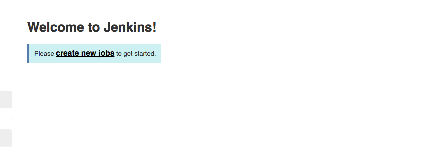
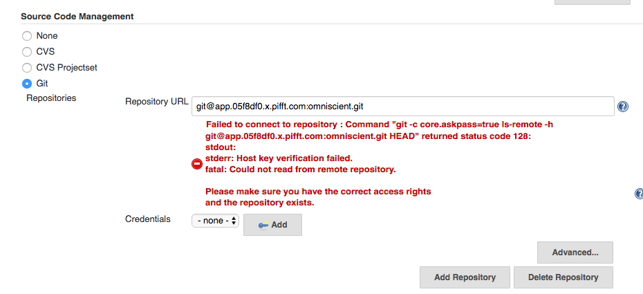
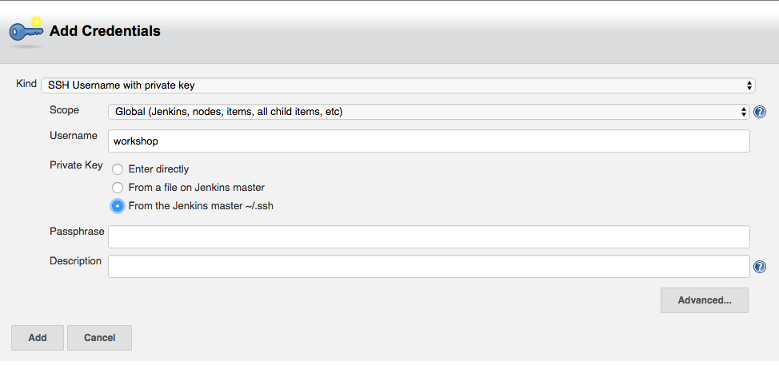
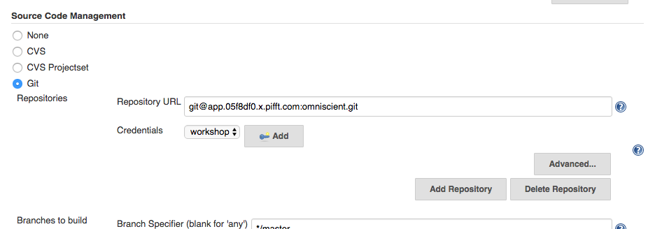
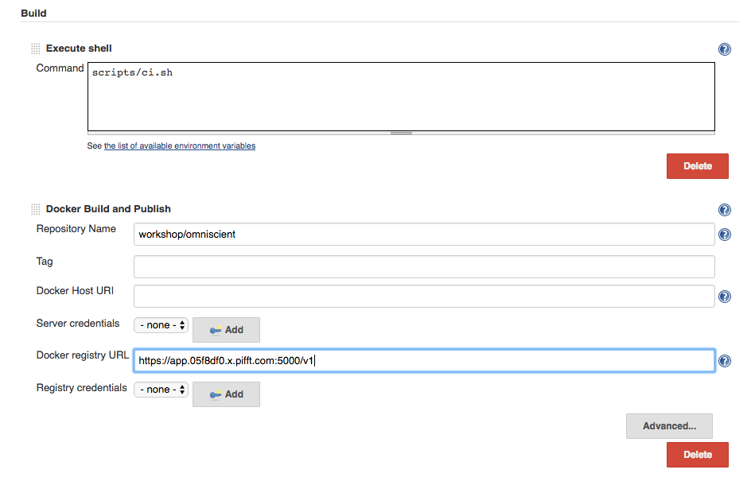
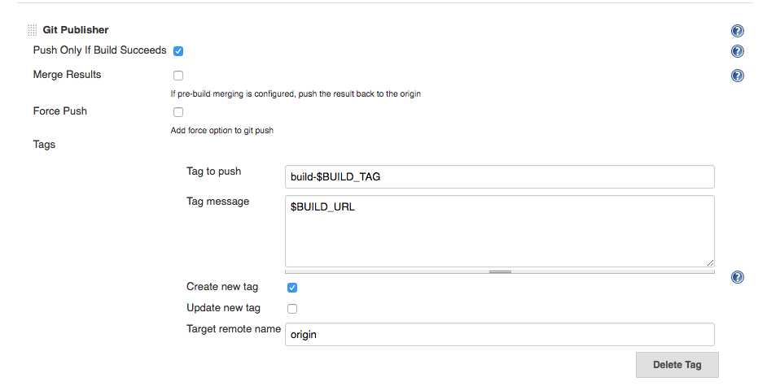
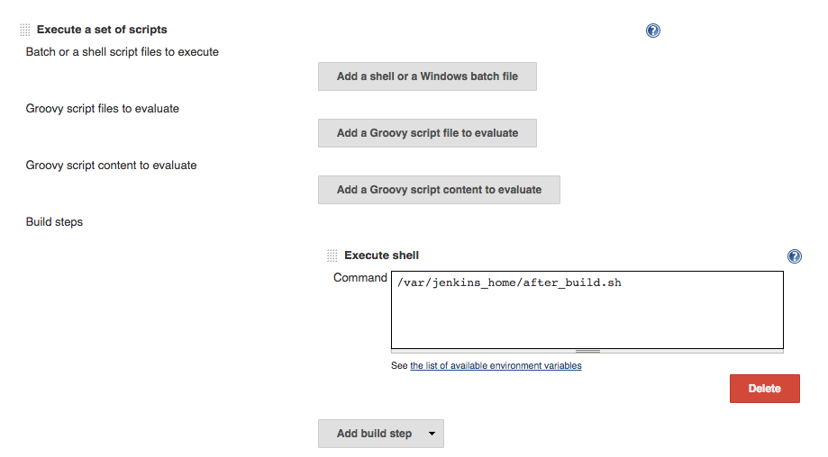

# Continuous Integration With Jenkins

The goal of this lab is to configure Jenkins to build our project.

## Navigating to Jenkins

## Creating a Jenkins Job

### Describing the job

* Fill in `Item name` with `Omniscient` and choose `Freestyle project`.
* Press `OK` to create your project.

### Configure Git settings

You are now on the project configuration page. The first thing we are going to do is configure
our Source Code Management. Omniscient lives in a Git repository, so we'll configure access for it.

* First, add the URL of your git repository. In the example, it is `git@app.05f8df0.x.pifft.com:omniscient.git`.
Make sure to replace the project ID with your project ID. Your project ID can be retrieved in Slack by
typing `./settings`.
* The error we have received is normal because Jenkins doesn't yet know what credentials it needs to talk
to the repository. Click t he `Add` button to add new credentials.

* Choose `SSH Username with private key` for the `Kind`.
* Fiill in `Username` with `workshop`.
* Choose `From the Jenkins master ~/.ssh` for `Private Key`.
* Click `Add`

When your environment was provisioned, a SSH key was generated for you.

In the `Credentials` select box, choose `workshop`.

### Configure build settings

Next, we will configure the build.

* Under Build, choose `Add build step / Execute shell`
* In `Command`, enter `scripts/ci.sh`
* Under Build, choose `Add build step / Docker Build and Publish
* Set `Repository Name` to `workshop/omniscient`
* Set `Docker registry URL` to `https://app.05f8df0.x.pifft.com:5000/v1` ensuring your are using the proper
project ID.

Finallly, we will configure the post build actions.

### Adding a build tag to git

* Under `Post-build Actions`, choose `Add post-build action / Git Publisher`
* Select `Push Only If Build Succeeds`
* Click `Add Tag`
* Set `Tag to Push` to `build-$BUILD_TAG`
* Set `Tag message` to `$BUILD_URL`
* Set `Tag remote name` to `origin`

### Create a post build notification script

* Under `Post-build Actions`, choose `Execute a set of scripts`
* Under `Build steps` select `Add build step / Execute shell`
* Fill in `Command` with `/var/jenkins_home/after_build.sh`

### Save our work

Click `Save`
