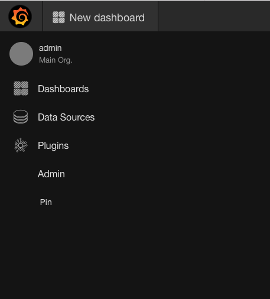
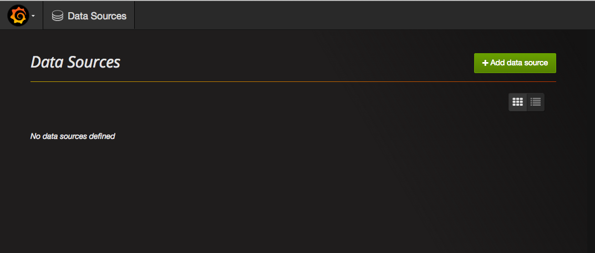
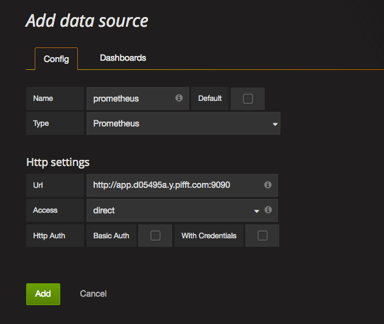
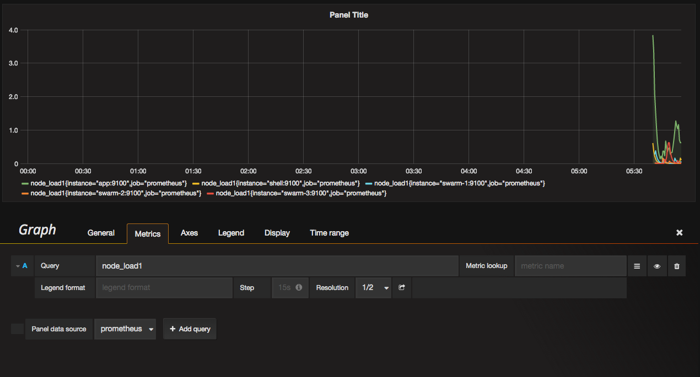

# Metrics with prometheus

## Viewing metrics

* In Slack, issue the `./settings` command and follow the link to Prometheus.
* Click Status link to view configuration and settings
* Click Grpah link to view Graphs

## Graphs in Grafana

* In Slack, issue the `./settings` command and follow the link to Prometheus.
* Login to Grafana with user `admin` and password `admin`

### Add datasource

### Add graph

