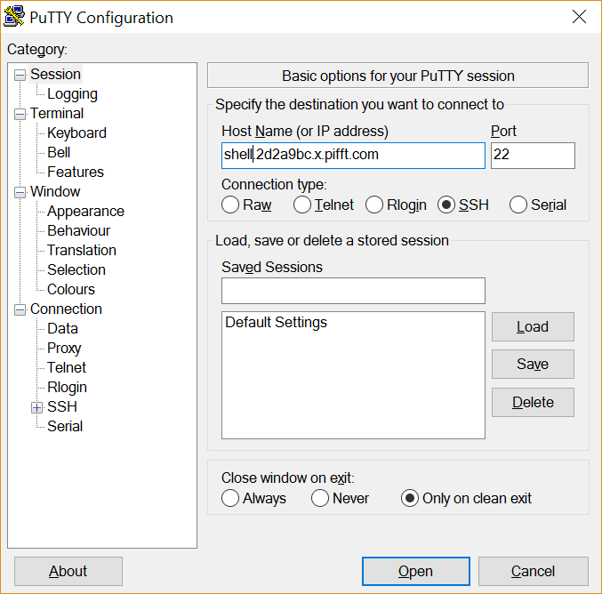
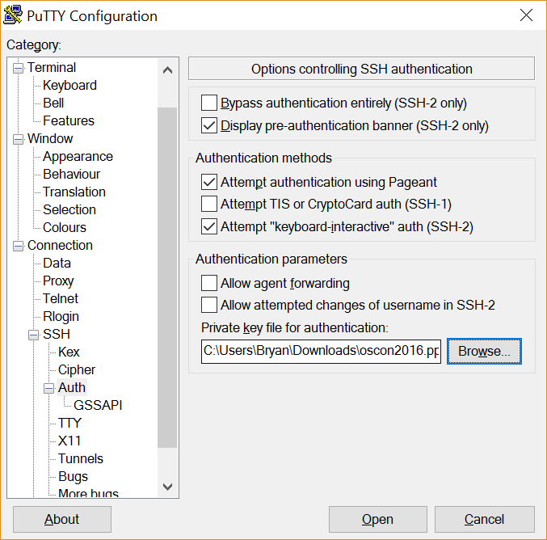

# Windows SSH with Putty

Once you have a ppk file, you can configure Putty.

* Launch Putty
* Add host name as shell.`project id`.x.pifft.com
* Configure putty to use your PPK as auth
* Click `Open`

